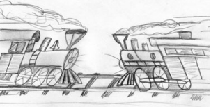

# اشیاء و ساختارهای داده


<div dir="rtl">
دلیلی وجود دارد که ما متغیرهای خود را خصوصی نگه می‌داریم. نمی‌خواهیم هیچ‌کس دیگری به آن‌ها وابسته باشد. ما می‌خواهیم آزادی تغییر نوع یا پیاده‌سازی آن‌ها را به دلخواه و به طور ناگهانی حفظ کنیم. پس چرا این‌قدر برنامه‌نویس‌ها به‌طور خودکار getter و setter به اشیاء خود اضافه می‌کنند و متغیرهای خصوصی خود را مانند متغیرهای عمومی در معرض دید قرار می‌دهند؟

## انتزاع داده
به تفاوت بین لیست ۶-۱ و لیست ۶-۲ توجه کنید. هر دو نمایانگر داده‌های یک نقطه بر روی صفحه کارتیزین هستند. با این حال، یکی پیاده‌سازی خود را آشکار می‌کند و دیگری به‌طور کامل آن را پنهان می‌کند.
</div>

Listing 6-1 - Concrete Point
```java
public class Point {
 public double x;
 public double y;
}
```

Listing 6-2 - Abstract Point
```java
public interface Point {
 double getX();
 double getY();
 void setCartesian(double x, double y);
 double getR();
 double getTheta();
 void setPolar(double r, double theta);
}
```
<div dir="rtl">
چیز زیبایی که در لیست ۶-۲ وجود دارد این است که هیچ راهی برای تشخیص اینکه پیاده‌سازی در مختصات مستطیلی یا قطبی است، وجود ندارد. ممکن است هیچ‌کدام نباشد! و با این حال، رابط به‌طور واضحی یک ساختار داده را نمایان می‌کند.

اما این رابط بیشتر از یک ساختار داده را نمایان می‌کند. متدها یک سیاست دسترسی را تحمیل می‌کنند. شما می‌توانید مختصات فردی را به‌صورت مستقل بخوانید، اما باید مختصات را به‌صورت یک عملیات اتمی تنظیم کنید.

از سوی دیگر، لیست ۶-۱ به‌وضوح در مختصات مستطیلی پیاده‌سازی شده است و ما را مجبور می‌کند که آن مختصات را به‌طور مستقل دستکاری کنیم. این پیاده‌سازی را آشکار می‌کند. در واقع، حتی اگر متغیرها خصوصی بودند و ما از getter ها و setter های تک‌متغیره استفاده می‌کردیم، باز هم پیاده‌سازی را آشکار می‌کرد.

پنهان‌سازی پیاده‌سازی تنها یک مسأله از قرار دادن یک لایه از توابع بین متغیرها نیست. پنهان‌سازی پیاده‌سازی مربوط به انتزاعات است! یک کلاس به‌سادگی متغیرهای خود را از طریق دریافت‌کننده‌ها و تنظیم‌کننده‌ها بیرون نمی‌آورد. بلکه رابط‌های انتزاعی را نمایان می‌کند که به کاربرانش اجازه می‌دهد جوهر داده‌ها را دستکاری کنند، بدون اینکه نیاز به دانستن پیاده‌سازی آن‌ها داشته باشند.

به لیست ۶-۳ و لیست ۶-۴ توجه کنید. مورد اول از اصطلاحات عینی برای بیان سطح سوخت یک وسیله نقلیه استفاده می‌کند، در حالی که مورد دوم این کار را با انتزاع درصد انجام می‌دهد. در حالت عینی می‌توانید به‌طور تقریبی مطمئن باشید که این فقط دسترسی به متغیرها است. در حالت انتزاعی، هیچ ایده‌ای درباره‌ی شکل داده‌ها ندارید.
</div>

Listing 6-3 - Concrete Vehicle
```java
public interface Vehicle {
 double getFuelTankCapacityInGallons();
 double getGallonsOfGasoline();
}
```

Listing 6-4 - Abstract Vehicle
```java
public interface Vehicle {
 double getPercentFuelRemaining();
}
```

<div dir="rtl">
در هر دو مورد بالا، گزینه دوم ترجیح داده می‌شود. ما نمی‌خواهیم جزئیات داده‌های خود را آشکار کنیم. بلکه می‌خواهیم داده‌های خود را به زبان انتزاعی بیان کنیم. این تنها با استفاده از رابط‌ها و یا دریافت‌کننده‌ها و تنظیم‌کننده‌ها به‌دست نمی‌آید. باید به طور جدی به بهترین روش برای نمایندگی داده‌هایی که یک شیء دربر دارد فکر کنیم. بدترین گزینه این است که به سادگی دریافت‌کننده‌ها و تنظیم‌کننده‌ها را اضافه کنیم.

## داده/شئ نامتقارن
این دو مثال تفاوت بین اشیاء و ساختارهای داده را نشان می‌دهند. اشیاء داده‌های خود را پشت انتزاعات پنهان می‌کنند و توابعی را که بر روی آن داده‌ها عمل می‌کنند، آشکار می‌سازند. در مقابل، ساختارهای داده داده‌های خود را نمایان می‌کنند و هیچ تابع معنی‌داری ندارند. دوباره به آن برگردید و بخوانید. به ماهیت مکمل این دو تعریف توجه کنید. آن‌ها عملاً ضد یکدیگر هستند. این تفاوت ممکن است ناچیز به نظر برسد، اما پیامدهای گسترده‌ای دارد.

به عنوان مثال، به مثال شکلی رویه‌ای در لیست ۶-۵ توجه کنید. کلاس Geometry بر روی سه کلاس شکل عمل می‌کند. کلاس‌های شکل (shape) ساختار داده های ساده‌ای هستند که هیچ رفتاری ندارند. تمام رفتار در کلاس Geometry وجود دارد.
</div>

Listing 6-5 - Procedural Shape
```java
public class Square {
  public Point topLeft;
  public double side;
}
public class Rectangle {
  public Point topLeft;
  public double height;
  public double width;
}
public class Circle {
  public Point center;
  public double radius;
}
public class Geometry {
  public final double PI = 3.141592653589793;
  public double area(Object shape) throws NoSuchShapeException {
    if (shape instanceof Square) {
      Square s = (Square) shape;
      return s.side * s.side;
    } else if (shape instanceof Rectangle) {
      Rectangle r = (Rectangle) shape;
      return r.height * r.width;
    } else if (shape instanceof Circle) {
      Circle c = (Circle) shape;
      return PI * c.radius * c.radius;
    }
    throw new NoSuchShapeException();
  }
}
```
<div dir="rtl">
برنامه‌نویسان شیء‌گرا ممکن است به این موضوع اعتراض کنند و بگویند که این رویه‌ای است—و آن‌ها حق دارند. اما این تحقیر ممکن است توجیه‌پذیر نباشد. تصور کنید اگر یک تابع perimeter() به کلاس Geometry اضافه شود. کلاس‌های شکل تحت تأثیر قرار نخواهند گرفت! هیچ کلاس دیگری که به اشکال وابسته باشد نیز تحت تأثیر قرار نخواهد گرفت! از سوی دیگر، اگر من یک شکل جدید اضافه کنم، باید تمام توابع در Geometry را برای مدیریت آن تغییر دهم. دوباره این را بخوانید. به این نکته توجه کنید که این دو وضعیت به‌طور کاملاً متضاد هستند.

حال به راه‌حل شیء‌گرا در لیست ۶-۶ توجه کنید. در اینجا، متد area() چندریختی (polymorphic) است. نیازی به کلاس Geometry نیست. بنابراین اگر من یک شکل جدید اضافه کنم، هیچ‌یک از توابع موجود تحت تأثیر قرار نمی‌گیرند، اما اگر یک تابع جدید اضافه کنم، تمام اشکال باید تغییر کنند!
</div>

Listing 6-6 - Polymorphic Shapes
```java
public class Square implements Shape {
  private Point topLeft;
  private double side;
  public double area() {
    return side * side;
  }
}
public class Rectangle implements Shape {
  private Point topLeft;
  private double height;
  private double width;
  public double area() {
    return height * width;
  }
}
public class Circle implements Shape {
  private Point center;
  private double radius;
  public final double PI = 3.141592653589793;
  public double area() {
    return PI * radius * radius;
  }
}
```
<div dir="rtl">
دوباره، ما به ماهیت مکمل این دو تعریف می‌رسیم؛ آن‌ها عملاً ضد یکدیگر هستند! این موضوع تضاد اساسی بین اشیاء و ساختارهای داده را آشکار می‌کند:

`
کد رویه‌ای (کدی که از ساختارهای داده استفاده می‌کند) افزودن توابع جدید بدون تغییر ساختارهای داده موجود را آسان می‌کند. از طرف دیگر، کد شیء‌گرا (OO) افزودن کلاس‌های جدید بدون تغییر توابع موجود را آسان می‌کند.
`

این مکمل نیز صادق است:

`
 کد رویه‌ای افزودن ساختارهای داده جدید را دشوار می‌کند زیرا همه توابع باید تغییر کنند. کد شیء‌گرا (OO) افزودن توابع جدید را دشوار می‌کند زیرا همه کلاس‌ها باید تغییر کنند.
`

بنابراین، چیزهایی که برای کد شیء‌گرا (OO) دشوار است برای رویه‌ای‌ها آسان است و چیزهایی که برای رویه‌ای‌ها دشوار است برای کد شیء‌گرا آسان است!
در هر سیستم پیچیده، زمان‌هایی وجود دارد که می‌خواهیم انواع داده جدیدی به جای توابع جدید اضافه کنیم. برای این موارد، اشیاء و شیء‌گرایی(OO) مناسب‌ترین هستند. از طرف دیگر، زمان‌هایی نیز وجود خواهد داشت که می‌خواهیم توابع جدیدی در مقابل انواع داده اضافه کنیم. در آن صورت، کد رویه‌ای و ساختارهای داده مناسب‌تر خواهند بود.

برنامه‌نویسان با تجربه می‌دانند که ایده اینکه همه‌چیز یک شیء است یک افسانه است. گاهی اوقات واقعاً به ساختارهای داده ساده‌ای با رویه‌هایی که بر روی آن‌ها عمل می‌کنند نیاز داریم.

## قانون دمر (Demeter)
 یک قاعده معروف است که می‌گوید یک ماژول نباید از جزئیات داخلی اشیایی که با آن‌ها کار می‌کند، آگاه باشد. همان‌طور که در بخش قبل دیدیم، اشیاء داده‌های خود را پنهان می‌کنند و عملیات‌هایی را نمایان می‌سازند. این بدین معناست که یک شیء نباید ساختار داخلی خود را از طریق دسترسی‌دهنده‌ها (accessors) افشا کند، زیرا این کار به معنای افشای ساختار داخلی، به جای پنهان کردن آن است.
به‌طور دقیق‌تر، قانون دمر می‌گوید که یک متد  f از کلاس  C فقط باید متدهای این موارد را فراخوانی کند:

- C

- یک شیء که توسط  f ایجاد شده است

- یک شیء که به‌عنوان آرگومان به  f منتقل شده است

- یک شیء که در یک متغیر نمونه از  c نگهداری می‌شود

این اصل به کاهش وابستگی‌های بین ماژول‌ها کمک می‌کند و طراحی نرم‌افزار را مدولارتر و قابل نگهداری‌تر می‌سازد. به‌عبارت دیگر، رعایت این قانون می‌تواند منجر به کدهای تمیزتر و با ثبات‌تر شود.
متد نباید متدهایی را روی اشیائی که توسط هر یک از توابع مجاز بازمی‌گردند، فراخوانی کند. به عبارت دیگر، باید با دوستان صحبت کنید، نه با غریبه‌ها.

کد زیر به‌نظر می‌رسد که قانون دمر را نقض می‌کند (علاوه بر موارد دیگر) زیرا ابتدا تابع  getScratchDir() را بر روی نتیجه‌ی تابع  getOptions() فراخوانی می‌کند و سپس تابع  getAbsolutePath() را بر روی نتیجه‌ی getScratchDir() فراخوانی می‌کند:

</div>

```java
final String outputDir = ctxt.getOptions().getScratchDir().getAbsolutePath();
```

<div dir="rtl">

## قطار تصادفی
این نوع کد معمولاً به عنوان "قطار تصادفی" نامیده می‌شود زیرا به نظر می‌رسد که مجموعه‌ای از واگن‌های متصل به هم هستند. زنجیره‌های فراخوانی مانند این معمولاً به عنوان یک سبک شل و بی‌نظم در نظر گرفته می‌شوند و باید از آن‌ها پرهیز کرد. بهترین کار معمولاً این است که آن‌ها را به شکل زیر تقسیم کنید:
</div>

```java
Options opts = ctxt.getOptions();
File scratchDir = opts.getScratchDir();
final String outputDir = scratchDir.getAbsolutePath();
```


<div dir="rtl">
آیا این دو قطعه کد نقض قانون دمر هستند؟ قطعاً ماژول حاوی کد می‌داند که شیء ctxt شامل گزینه‌ها است، که شامل یک دایرکتوری موقت است، که دارای یک مسیر مطلق است. این اطلاعات زیادی برای یک تابع است که باید بداند. تابع فراخوانی‌کننده می‌داند که چگونه از میان بسیاری از اشیاء مختلف عبور کند.

اینکه آیا این نقض قانون دمر است یا نه، به این بستگی دارد که آیا ctxt، Options و ScratchDir اشیاء هستند یا ساختارهای داده. اگر آن‌ها اشیاء هستند، پس ساختار داخلی آن‌ها باید پنهان باشد نه اینکه افشا شود و بنابراین آگاهی از جزئیات داخلی آن‌ها نقض واضح قانون دمر است. از سوی دیگر، اگر ctxt، Options و ScratchDir تنها ساختارهای داده‌ای بدون رفتار باشند، پس به‌طور طبیعی ساختار داخلی خود را افشا می‌کنند و بنابراین قانون دمر اعمال نمی‌شود.

استفاده از توابع دسترسی‌دهنده (accessor) موضوع را پیچیده می‌کند. اگر کد به صورت زیر نوشته شده بود، احتمالاً درباره‌ی نقض قانون دمر سوالی نمی‌کردیم:
</div>

```java
final String outputDir = ctxt.options.scratchDir.absolutePath;
```

<div dir="rtl">
این مسئله بسیار کمتر گیج‌کننده خواهد بود اگر ساختارهای داده فقط متغیرهای عمومی داشته باشند و هیچ تابعی نداشته باشند، در حالی که اشیاء متغیرهای خصوصی و توابع عمومی داشته باشند. با این حال، چارچوب‌ها و استانداردهایی (مانند "beans") وجود دارند که حتی از ساختارهای داده ساده نیز می‌خواهند که دارای توابع دسترسی‌دهنده و تنظیم‌کننده باشند.

## هیبریدها
این سردرگمی گاهی منجر به ایجاد ساختارهای هیبریدی نامطلوبی می‌شود که نیمی شیء و نیمی ساختار داده هستند. این ساختارها توابعی دارند که کارهای مهمی انجام می‌دهند و همچنین دارای متغیرهای عمومی یا دسترسی‌دهنده‌ها و تنظیم‌کننده‌های عمومی هستند که در واقع متغیرهای خصوصی را عمومی می‌کنند و سایر توابع خارجی را وسوسه می‌کنند تا از این متغیرها به روشی استفاده کنند که یک برنامه رویه‌ای از یک ساختار داده استفاده می‌کند.

این هیبریدها افزودن توابع جدید را دشوار می‌کنند و همچنین افزودن ساختارهای داده جدید را نیز مشکل می‌سازند. آن‌ها بدترین حالت از هر دو جهان هستند. از ایجاد آن‌ها پرهیز کنید. این ساختارها نشان‌دهنده طراحی سردرگمی هستند که نویسندگان آن مطمئن نیستند—یا بدتر، از آن بی‌اطلاع هستند—که آیا به محافظت در برابر توابع یا انواع نیاز دارند.

## پنهان‌سازی ساختار
اگر ctxt، options و scratchDir اشیایی با رفتار واقعی باشند چه؟

 در این صورت، از آنجا که اشیاء باید ساختار داخلی خود را پنهان کنند، نباید بتوانیم از طریق آن‌ها عبور کنیم. در این صورت، چگونه می‌توانیم مسیر مطلق دایرکتوری موقت را به‌دست آوریم؟
</div>

```java
ctxt.getAbsolutePathOfScratchDirectoryOption();
```
<div dir="rtl">
یا 
</div>

```java
ctx.getScratchDirectoryOption().getAbsolutePath()
```
<div dir="rtl">
گزینه اول می‌تواند منجر به انفجار متدها در شیء ctxt شود. گزینه دوم فرض می‌کند که getScratchDirectoryOption() یک ساختار داده برمی‌گرداند، نه یک شیء. هیچ‌کدام از این گزینه‌ها احساس خوبی نمی‌دهد.

اگر ctxt یک شیء باشد، باید از آن بخواهیم که کاری انجام دهد؛ نباید از آن درباره‌ی جزئیات داخلی‌اش سوال کنیم. پس چرا ما به مسیر مطلق دایرکتوری موقت نیاز داشتیم؟ قرار بود با آن چه کنیم؟ به این کد از (چند خط پایین‌تر در) همان ماژول توجه کنید:
</div>

```java
String outFile = outputDir + "/" + className.replace('.', '/') + ".class";
FileOutputStream fout = new FileOutputStream(outFile);
BufferedOutputStream bos = new BufferedOutputStream(fout);
```
<div dir="rtl">
ترکیب سطوح مختلف جزئیات کمی نگران‌کننده است. نقطه‌ها، اسلش‌ها، پسوندهای فایل و اشیاء فایل نباید به‌طور بی‌پروا با هم ترکیب شوند و همچنین با کد احاطه‌کننده. با وجود این، می‌بینیم که هدف از به‌دست آوردن مسیر مطلق دایرکتوری موقت، ایجاد یک فایل موقت با نام مشخصی بود.
پس، اگر به شیء ctxt بگوییم که این کار را انجام دهد؟
</div>

```java
BufferedOutputStream bos = ctxt.createScratchFileStream(classFileName);
```
<div dir="rtl">
این به نظر می‌رسد که کار معقولی برای یک شیء باشد! این کار به ctxt اجازه می‌دهد تا جزئیات داخلی خود را پنهان کند و از نقض قانون دمر توسط تابع فعلی جلوگیری می‌کند، زیرا نیازی به عبور از اشیائی ندارد که نباید از آن‌ها آگاه باشد.

## اشیاء انتقال داده (Data Transfer Objects)
شکل اساسی یک ساختار داده، کلاسی با متغیرهای عمومی و بدون توابع است. این به‌گاه‌هایی به عنوان شیء انتقال داده یا DTO شناخته می‌شود. DTOها ساختارهای بسیار مفیدی هستند، به‌ویژه هنگام ارتباط با پایگاه‌های داده یا تجزیه پیام‌ها از سوکت‌ها و غیره. آن‌ها اغلب اولین مرحله در یک سری مراحل ترجمه هستند که داده‌های خام موجود در پایگاه داده را به اشیاء در کد برنامه تبدیل می‌کنند.
شکل رایج‌تر آن، فرم "bean" است که در لیست ۶-۷ نشان داده شده است. Beans دارای متغیرهای خصوصی هستند که توسط دسترسی‌دهنده‌ها و تنظیم‌کننده‌ها مدیریت می‌شوند. نیمه‌پنهان‌سازی beans به نظر می‌رسد که برخی از خالص‌گرایان شیءگرا را راحت‌تر کند، اما معمولاً هیچ سود دیگری ارائه نمی‌دهد.
</div>

Listing 6-7 - address.java
```java
public class Address {
  private String street;
  private String streetExtra;
  private String city;
  private String state;
  private String zip;
  public Address(String street, String streetExtra,
    String city, String state, String zip) {
    this.street = street;
    this.streetExtra = streetExtra;
    this.city = city;
    this.state = state;
    this.zip = zip;
  }
  public String getStreet() {
    return street;
  }
  public String getStreetExtra() {
    return streetExtra;
  }
  public String getCity() {
    return city;
  }
  public String getState() {
    return state;
  }
  public String getZip() {
    return zip;
  }
}
```

<div dir="rtl">

## رکوردهای فعال (Active Record)

رکوردهای فعال فرم‌های خاصی از DTOها هستند. آن‌ها ساختارهای داده با متغیرهای عمومی (یا متغیرهای دسترسی‌دهنده) هستند؛ اما معمولاً دارای متدهای ناوبری مانند save و find نیز هستند. معمولاً این رکوردهای فعال ترجمه‌های مستقیم از جدول‌های پایگاه داده یا سایر منابع داده هستند.

متأسفانه، اغلب می‌بینیم که توسعه‌دهندگان سعی می‌کنند این ساختارهای داده را به‌عنوان اشیاء در نظر بگیرند و متدهای قوانین کسب‌وکار را در آن‌ها قرار دهند. این کار ناخوشایند است زیرا یک هیبرید بین یک ساختار داده و یک شیء ایجاد می‌کند.
راه‌حل، البته، این است که رکورد فعال را به عنوان یک ساختار داده در نظر بگیریم و اشیاء جداگانه‌ای ایجاد کنیم که شامل قوانین کسب‌وکار باشند و داده‌های داخلی خود را پنهان کنند (که احتمالاً تنها نمونه‌هایی از رکورد فعال هستند).

## نتیجه‌گیری
اشیاء رفتار را نمایان می‌کنند و داده‌ها را پنهان می‌سازند. این امر افزودن انواع جدید اشیاء بدون تغییر رفتارهای موجود را آسان می‌کند. همچنین، افزودن رفتارهای جدید به اشیاء موجود را دشوار می‌سازد. ساختارهای داده، داده‌ها را نمایان می‌کنند و هیچ رفتار قابل توجهی ندارند. این امر افزودن رفتارهای جدید به ساختارهای داده موجود را آسان می‌کند، اما افزودن ساختارهای داده جدید به توابع موجود را دشوار می‌سازد.

در هر سیستم خاص، گاهی اوقات به انعطاف‌پذیری برای افزودن انواع داده جدید نیاز خواهیم داشت، و بنابراین برای آن بخش از سیستم، اشیاء را ترجیح می‌دهیم. در مواقع دیگر، به انعطاف‌پذیری برای افزودن رفتارهای جدید نیاز داریم و بنابراین در آن بخش از سیستم، انواع داده و رویه‌ها را ترجیح می‌دهیم.
توسعه‌دهندگان نرم‌افزار خوب این مسائل را بدون پیش‌داوری درک می‌کنند و رویکردی را انتخاب می‌کنند که برای کار در دست بهترین باشد.
</div>

* [فصل قبل](../5_Formatting/5_Formatting.md)
* [فصل بعد](../7_Error-Handling/Error-Handling.md)