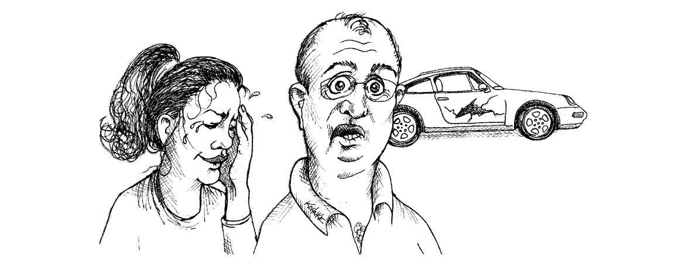

<div dir="rtl">

# مدیریت خطا

 
ممکن است وجود بخشی درباره مدیریت خطا در کتابی درباره کد تمیز عجیب به نظر برسد. اما مدیریت خطا یکی از جنبه‌هایی است که همه ما هنگام برنامه‌نویسی با آن مواجه می‌شویم. ورودی‌ها ممکن است غیرعادی باشند و دستگاه‌ها ممکن است خراب شوند. به طور خلاصه، ممکن است مشکلاتی پیش بیاید و در این شرایط، ما به عنوان برنامه‌نویس مسئولیت داریم که اطمینان حاصل کنیم کد ما به درستی عمل می‌کند.

اما ارتباط این موضوع با کد تمیز باید واضح باشد. بسیاری از پایگاه‌های کد به شدت تحت تأثیر مدیریت خطا قرار دارند. وقتی می‌گویم تحت تأثیر، منظورم این نیست که مدیریت خطا تنها کاری است که آنها انجام می‌دهند، بلکه به این معنی است که به دلیل پراکندگی مدیریت خطا، تقریباً غیرممکن است که بفهمیم کد چه کاری انجام می‌دهد. مدیریت خطا مهم است، اما اگر باعث اختلال در منطق کد شود، اشتباه است.

در این فصل، تعدادی تکنیک و نکته را معرفی می‌کنم که می‌توانید برای نوشتن کدی که هم تمیز و هم مقاوم باشد، استفاده کنید—کدی که به شیوه‌ای شایسته و با سبک به مدیریت خطا می‌پردازد.

## از Exception ها به جای return کردن کد خطا استفاده کنید

در گذشته‌های دور، زبان‌های زیادی وجود داشتند که استثنا نداشتند. در این زبان‌ها، تکنیک‌های مدیریت و گزارش خطا محدود بود. شما یا باید یک پرچم خطا تعیین می‌کردید یا یک کد خطا بازمی‌گرداندید که فراخواننده می‌توانست آن را بررسی کند. کد موجود در فهرست ۷-۱ این روش‌ها را نشان می‌دهد.

</div>
Listing 7-1 -- DeviceController.java

```java
public class DeviceController {
  ...
  public void sendShutDown() {
      DeviceHandle handle = getHandle(DEV1);
      // Check the state of the device
      if (handle != DeviceHandle.INVALID) {
        // Save the device status to the record field
        retrieveDeviceRecord(handle);
        // If not suspended, shut down
        if (record.getStatus() != DEVICE_SUSPENDED) {
          pauseDevice(handle);
          clearDeviceWorkQueue(handle);
          closeDevice(handle);
        } else {
          logger.log("Device suspended. Unable to shut down");
        }
      } else {
        logger.log("Invalid handle for: " + DEV1.toString());
      }
    }
    ...
}
```

<div dir="rtl">
مشکل این رویکردها این است که کد فراخواننده را شلوغ می‌کند. فراخواننده باید بلافاصله پس از فراخوانی، خطاها را بررسی کند. متأسفانه، به راحتی ممکن است این مورد فراموش شود. به همین دلیل بهتر است هنگامی که با یک خطا مواجه می‌شوید، یک استثنا پرتاب کنید. این کار باعث می‌شود کد فراخواننده تمیزتر باشد و منطق آن تحت تأثیر مدیریت خطا قرار نگیرد. فهرست ۷-۲ کد را نشان می‌دهد پس از اینکه تصمیم به پرتاب استثنا در متدهایی که می‌توانند خطا را شناسایی کنند، گرفته‌ایم.
</div>

Listing 7-2 -- DeviceController.java (with exceptions)

```java
public class DeviceController {
  ...
  public void sendShutDown() {
    try {
      tryToShutDown();
    } catch (DeviceShutDownError e) {
      logger.log(e);
    }
  }
  private void tryToShutDown() throws DeviceShutDownError {
    DeviceHandle handle = getHandle(DEV1);
    DeviceRecord record = retrieveDeviceRecord(handle);
    pauseDevice(handle);
    clearDeviceWorkQueue(handle);
    closeDevice(handle);
  }
  private DeviceHandle getHandle(DeviceID id) {
      ...
      throw new DeviceShutDownError("Invalid handle for: " + id.toString());
      ...
    }
    ...
}
```

<div dir="rtl">
توجه کنید به چه میزان تمیزتر شده است. این فقط یک مسئله زیبایی‌شناسی نیست. کد بهتر شده زیرا دو نگرانی که با هم در هم پیچیده بودند، یعنی الگوریتم خاموش کردن دستگاه و مدیریت خطا، اکنون از هم جدا شده‌اند. شما می‌توانید هر یک از این نگرانی‌ها را به‌طور مستقل بررسی و درک کنید.

## اولین وضعیت try-catch-finally خود را بنویسید.

یکی از جالب‌ترین نکات درباره استثناها این است که آن‌ها یک محدوده درون برنامه شما تعریف می‌کنند. زمانی که کد را در بخش try یک جمله try-catch-finally اجرا می‌کنید، در واقع بیان می‌کنید که اجرا در هر نقطه‌ای ممکن است متوقف شود و سپس در بخش catch از سر گرفته شود.

به نوعی، بلوک‌های try مانند تراکنش‌ها هستند. catch شما باید برنامه شما را در یک حالت سازگار ترک کند، فرقی نمی‌کند چه اتفاقی در بخش try بیفتد. به همین دلیل، شروع با یک جمله try-catch-finally هنگامی که کدی می‌نویسید که ممکن است استثنا پرتاب کند، یک رویه خوب است. این به شما کمک می‌کند تا مشخص کنید کاربر آن کد باید چه انتظاری داشته باشد، صرف‌نظر از اینکه چه چیزی در کدی که در بخش try اجرا می‌شود، اشتباه پیش برود.

بیایید یک مثال را بررسی کنیم. ما باید کدی بنویسیم که به یک فایل دسترسی پیدا کند و برخی اشیاء سریال‌شده را بخواند.

ما با یک unit test شروع می‌کنیم که نشان می‌دهد وقتی فایل وجود ندارد، یک استثنا خواهیم گرفت:

</div>

```java
 @Test(expected = StorageException.class)
 public void retrieveSectionShouldThrowOnInvalidFileName() {
   sectionStore.retrieveSection("invalid - file");
 }
```

<div dir="rtl">
test ما را مجبور می‌کند که این کد موقتی را بنویسیم.
</div>

```java
public List<RecordedGrip> retrieveSection(String sectionName) {
  // dummy return until we have a real implementation
  return new ArrayList<RecordedGrip>();
}
```

<div dir="rtl">
test ما شکست می‌خورد زیرا استثنایی پرتاب نمی‌کند. سپس، پیاده‌سازی‌مان را تغییر می‌دهیم تا سعی کند به یک فایل نامعتبر دسترسی پیدا کند. این عمل یک استثنا پرتاب می‌کند:
</div>

```java
public List<RecordedGrip> retrieveSection(String sectionName) {
  try {
    FileInputStream stream = new FileInputStream(sectionName)
  } catch (Exception e) {
    throw new StorageException("retrieval error", e);
  }
  return new ArrayList<RecordedGrip>();
}
```

<div dir="rtl">
اکنون test ما موفقیت‌آمیز است زیرا استثنا را گرفته‌ایم. در این مرحله، می‌توانیم کد را بهبود دهیم. می‌توانیم نوع استثنایی که می‌گیریم را دقیق‌تر کنیم تا با نوعی که واقعاً از سازنده FileInputStream پرتاب می‌شود، یعنی FileNotFoundException، مطابقت داشته باشد:
</div>

```java
public List<RecordedGrip> retrieveSection(String sectionName) {
    try {
      FileInputStream stream = new FileInputStream(sectionName);
      stream.close();
    } catch (FileNotFoundException e) {
      throw new StorageException("retrieval error", e);
      }
      return new ArrayList<RecordedGrip>();
    }
```

<div dir="rtl">
حالا که محدوده را با ساختار try-catch تعریف کرده‌ایم، می‌توانیم از TDD برای ساخت بقیه منطق مورد نیاز استفاده کنیم. این منطق بین ایجاد FileInputStream و بستن آن اضافه خواهد شد و می‌تواند طوری رفتار کند که انگار هیچ چیزی اشتباه نمی‌شود.

سعی کنید تست‌هایی بنویسید که باعث ایجاد استثناها شوند، سپس رفتار handler خود را به‌گونه‌ای اضافه کنید که تست‌ها را تأمین کند. این کار باعث می‌شود ابتدا محدوده تراکنش بلوک try را بسازید و به شما کمک می‌کند تا ماهیت تراکنش این محدوده را حفظ کنید.

## از استثناهای بدون چک استفاده کنید.

 وقتی که استثناهای چک‌شده در نسخه اول جاوا معرفی شدند، به نظر ایده‌ای عالی می‌آمدند. امضای هر متد شامل تمام استثناهایی بود که می‌توانست به فراخواننده‌اش منتقل کند. علاوه بر این، این استثناها بخشی از نوع متد بودند. اگر امضا با کاری که کد شما انجام می‌دهد مطابقت نداشت، کد شما عملاً کامپایل نمی‌شد.

در آن زمان، فکر می‌کردیم استثناهای چک‌شده ایده خوبی هستند و بله، می‌توانند فوایدی داشته باشند. با این حال، اکنون روشن است که برای تولید نرم‌افزارهای پایدار، وجود آن‌ها ضروری نیست. زبان C# استثناهای چک‌شده ندارد و با وجود تلاش‌های شجاعانه، C++ نیز چنین نیست. نه پایتون و نه روبی هم استثناهای چک‌شده ندارند. اما امکان نوشتن نرم‌افزارهای پایدار در تمام این زبان‌ها وجود دارد. از آنجایی که این‌طور است، باید واقعاً تصمیم بگیریم که آیا استثناهای چک‌شده به نسبت هزینه ای که دارند مفیدند یا خیر.

چه قیمتی؟ قیمت استثناهای چک‌شده نقض اصول Open/Closed است. اگر از یک متد در کد خود یک استثنای چک‌شده را throws کنید و catch در سه سطح بالاتر باشد، باید آن استثنا را در امضای هر متد بین خود و catch اعلام کنید. این به این معنی است که یک تغییر در سطح پایین نرم‌افزار می‌تواند تغییرات امضا را در بسیاری از سطوح بالاتر اجباری کند. ماژول‌های تغییر یافته باید دوباره ساخته و مستقر شوند، حتی اگر چیزی که برایشان مهم است تغییر نکرده باشد.

سلسله مراتب فراخوانی در یک سیستم بزرگ را تصور کنید. توابع در بالای سلسله مراتب توابع زیر خود را فراخوانی می‌کنند، که توابع بیشتری را در زیر خود فراخوانی می‌کنند، و به همین ترتیب. حال بیایید بگوییم یکی از توابع در پایین‌ترین سطح به گونه‌ای اصلاح شده است که باید یک استثنا را throws کند. اگر آن استثنا چک‌شده باشد، باید یک clause throws به امضای تابع اضافه شود. اما این به این معنی است که هر تابعی که تابع اصلاح شده ما را فراخوانی می‌کند نیز باید یا برای catch استثنای جدید تغییر کند یا clause throws مناسب را به امضای خود اضافه کند. به همین ترتیب. نتیجه نهایی یک سلسله تغییرات است که از پایین‌ترین سطوح نرم‌افزار به بالاترین سطوح می‌رسد! کپسوله‌سازی شکسته می‌شود زیرا تمام توابع در مسیر یک throws باید از جزئیات آن استثنای سطح پایین مطلع باشند. با توجه به اینکه هدف از استثناها این است که به شما اجازه دهند خطاها را از فاصله‌ای دور مدیریت کنید، متأسفانه استثناهای چک‌شده به این شکل کپسوله‌سازی را می‌شکنند.

استثناهای چک‌شده گاهی می‌توانند مفید باشند اگر شما در حال نوشتن یک کتابخانه حیاتی هستید: شما باید آن‌ها را catch کنید. اما در توسعه برنامه‌های عمومی، هزینه‌های وابستگی معمولاً بر فواید غلبه می‌کند.

## فراهم کردن context با استفاده از استثناها

هر استثنایی که شما thrown می‌کنید باید زمینه کافی برای تعیین منبع و محل خطا را فراهم کند. در جاوا، می‌توانید یک stack trace از هر استثنا دریافت کنید؛ اما یک stack trace نمی‌تواند نیت عملیاتی که شکست خورده است را به شما بگوید.

پیام‌های خطای مفهومی ایجاد کنید و آن‌ها را به همراه استثناهای خود ارسال کنید. عملیات ناموفق و نوع شکست را ذکر کنید. اگر در برنامه‌تان لاگ‌گیری می‌کنید، اطلاعات کافی را برای لاگ کردن خطا در catch خود ارسال کنید.

## تعریف کلاس‌های استثنا بر اساس نیازهای فراخواننده

راه‌های زیادی برای طبقه‌بندی خطاها وجود دارد. می‌توانیم آن‌ها را بر اساس منبع‌شان طبقه‌بندی کنیم: آیا از یک مؤلفه خاص آمده‌اند یا نه؟ یا بر اساس نوع‌شان: آیا این خطاها ناشی از خرابی‌های دستگاه، خرابی‌های شبکه یا خطاهای برنامه‌نویسی هستند؟ با این حال، وقتی که کلاس‌های استثنا را در یک برنامه تعریف می‌کنیم، مهم‌ترین نگرانی ما باید این باشد که چگونه این استثناها catch می‌شوند.

بیایید به یک مثال از طبقه‌بندی ضعیف استثناها نگاه کنیم. در اینجا یک دستور try-catch-finally برای یک فراخوانی از یک کتابخانه شخص ثالث وجود دارد. این دستور تمام استثناهایی را که این فراخوانی‌ها می‌توانند thrown کنند، پوشش می‌دهد.
</div>

```java
ACMEPort port = new ACMEPort(12);
 try {
 port.open();
 } catch (DeviceResponseException e) {
 reportPortError(e);
 logger.log("Device response exception", e);
 } catch (ATM1212UnlockedException e) {
 reportPortError(e);
 logger.log("Unlock exception", e);
 } catch (GMXError e) {
 reportPortError(e);
 logger.log("Device response exception");
 } finally {
 …
 }
```

<div dir="rtl">
آن دستور شامل مقدار زیادی تکرار است و نباید تعجب کنیم. در بیشتر مواقع مدیریت استثنا، کاری که انجام می‌دهیم نسبتاً استاندارد است و ارتباطی به علت واقعی ندارد. ما باید یک خطا را ثبت کنیم و اطمینان حاصل کنیم که می‌توانیم به کار ادامه دهیم.

در این مورد، از آنجایی که می‌دانیم کارهایی که انجام می‌دهیم تقریباً مشابه است، بدون توجه به استثنا، می‌توانیم کد خود را به طور قابل توجهی ساده کنیم با wrapping کردن API که فراخوانی می‌کنیم و اطمینان از اینکه نوع استثنای مشترکی را برمی‌گرداند:
</div>

```java
LocalPort port = new LocalPort(12);
try {
  port.open();
} catch (PortDeviceFailure e) {
  reportError(e);
  logger.log(e.getMessage(), e);
} finally {
  …
}
 ```

<div dir="rtl">
کلاس LocalPort ما فقط یک wrapper ساده است که استثناهای thrown شده توسط کلاس ACMEPort را catch و ترجمه می‌کند:
</div>

```java
public class LocalPort {
  private ACMEPort innerPort;
  public LocalPort(int portNumber) {
    innerPort = new ACMEPort(portNumber);
  }
  public void open() {
    try {
      innerPort.open();
    } catch (DeviceResponseException e) {
      throw new PortDeviceFailure(e);
    } catch (ATM1212UnlockedException e) {
      throw new PortDeviceFailure(e);
    } catch (GMXError e) {
      throw new PortDeviceFailure(e);
    }
  }…
}
```

<div dir="rtl">
Wrapperها مانند آنچه برای ACMEPort تعریف کردیم می‌توانند بسیار مفید باشند. در واقع، wrapping APIهای شخص ثالث یک شیوه عالی است. زمانی که یک API شخص ثالث را wrap می‌کنید، وابستگی‌های خود به آن را حداقل می‌کنید: می‌توانید در آینده به یک کتابخانه دیگر منتقل شوید بدون اینکه هزینه زیادی بپردازید. Wrapping همچنین کار را برای mock کردن فراخوانی‌های شخص ثالث هنگام تست کد خود آسان‌تر می‌کند.

یک مزیت نهایی wrapping این است که شما به انتخاب‌های طراحی API یک فروشنده خاص وابسته نیستید. می‌توانید یک API تعریف کنید که با آن احساس راحتی کنید. در مثال قبلی، ما یک نوع استثنا برای خرابی دستگاه پورت تعریف کردیم و متوجه شدیم که می‌توانیم کد بسیار تمیزتری بنویسیم.

اغلب یک کلاس استثنا برای یک حوزه خاص از کد کافی است. اطلاعات ارسال شده با استثنا می‌تواند خطاها را متمایز کند. فقط در صورتی از کلاس‌های مختلف استفاده کنید که زمان‌هایی وجود داشته باشد که بخواهید یک استثنا را catch کنید و اجازه دهید دیگری عبور کند.

## تعریف جریان عادی


اگر از نکات مطرح شده در بخش‌های قبلی پیروی کنید، به جدایی خوبی بین منطق کسب‌وکار و مدیریت خطا خواهید رسید. بخش عمده کد شما شروع به شکل‌گیری به‌عنوان یک الگوریتم تمیز و ساده می‌کند. با این حال، این فرآیند تشخیص خطا را به حاشیه‌های برنامه شما می‌برد. شما APIهای خارجی را wrap می‌کنید تا بتوانید استثناهای خود را thrown کنید و یک handler بالاتر از کد خود تعریف می‌کنید تا بتوانید با هر محاسبه‌ای که متوقف می‌شود، برخورد کنید. بیشتر اوقات، این یک رویکرد عالی است، اما گاهی اوقات ممکن است نخواهید محاسبه را متوقف کنید.

بیایید به یک مثال نگاه کنیم. در اینجا کد نامناسبی وجود دارد که هزینه‌ها را در یک برنامه صورتحساب جمع می‌کند:

</div>

```java
try {
 MealExpenses expenses = expenseReportDAO.getMeals(employee.getID());
 m_total += expenses.getTotal();
} catch(MealExpensesNotFound e) {
 m_total += getMealPerDiem();
}
```

<div dir="rtl">
در این کسب‌وکار، اگر وعده‌های غذایی هزینه شوند، به مجموع اضافه می‌شوند. اگر هزینه نشوند، کارمند مبلغی به عنوان دستمزد وعده غذایی برای آن روز دریافت می‌کند. این استثنا منطق را شلوغ می‌کند. آیا بهتر نیست که نیازی به برخورد با این مورد خاص نداشته باشیم؟ اگر این‌طور بود، کد ما بسیار ساده‌تر به نظر می‌رسید. کد ما به این شکل خواهد بود:
</div>

```java
MealExpenses expenses = expenseReportDAO.getMeals(employee.getID());
m_total += expenses.getTotal();
```

<div dir="rtl">
آیا می‌توانیم کد را تا این حد ساده کنیم؟ به نظر می‌رسد که می‌توانیم. می‌توانیم کلاس ExpenseReportDAO را طوری تغییر دهیم که همیشه یک شیء MealExpense را برگرداند. اگر هزینه‌ای برای وعده‌های غذایی وجود نداشته باشد، یک شیء MealExpense برمی‌گرداند که دستمزد را به عنوان مجموع خود برمی‌گرداند:
</div>

```java
public class PerDiemMealExpenses implements MealExpenses {
 public int getTotal() {
 // return the per diem default
 }
}
```

<div dir="rtl">
این الگوی خاص [Fowler] نامیده می‌شود . شما یک کلاس ایجاد می‌کنید یا یک شیء را پیکربندی می‌کنید تا مورد خاصی را برای شما مدیریت کند. وقتی این کار را انجام می‌دهید، کد کلاینت نیازی به برخورد با رفتارهای استثنایی ندارد. آن رفتار در شیء مورد خاص کپسوله شده است.

## null برنگردانید

به نظر من هر بحثی در مورد مدیریت خطا باید شامل اشاره به کارهایی باشد که ما را به سمت خطا سوق می‌دهند. اولین مورد در این لیست، بازگرداندن null است. نمی‌توانم تعداد برنامه‌هایی را که دیده‌ام که تقریباً هر خط دیگر آن‌ها یک بررسی برای null بود، بشمارم. در اینجا یک کد نمونه وجود دارد:
</div>

```java
public void registerItem(Item item) {
  if (item != null) {
    ItemRegistry registry = peristentStore.getItemRegistry();
    if (registry != null) {
      Item existing = registry.getItem(item.getID());
      if (existing.getBillingPeriod().hasRetailOwner()) {
        existing.register(item);
      }
    }
  }
}
```

<div dir="rtl">
اگر در یک پایگاه کد با کدی مانند این کار کنید، ممکن است به نظر شما چندان بد نباشد، اما واقعاً بد است! وقتی null را باز می‌گردانیم، در واقع داریم برای خودمان کار ایجاد می‌کنیم و مشکلات را به دوش فراخواننده‌ها می‌گذاریم. تنها کافی است یک بررسی null فراموش شود تا یک برنامه از کنترل خارج شود.

آیا متوجه شدید که در خط دوم آن دستور if تو در تو، هیچ بررسی null وجود نداشت؟ اگر persistentStore null بود، در زمان اجرا چه اتفاقی می‌افتاد؟ ما با یک NullPointerException در زمان اجرا مواجه می‌شدیم، و یا کسی در سطح بالا NullPointerException را catch می‌کند یا نمی‌کند. در هر صورت، این بد است. دقیقاً چه باید کرد در پاسخ به یک NullPointerException که از عمق برنامه شما thrown شده است؟

گفتن اینکه مشکل کد بالا این است که یک بررسی null ندارد، آسان است، اما در واقعیت، مشکل این است که بیش از حد بررسی null دارد. اگر وسوسه می‌شوید که از یک متد null را بازگردانید، به جای آن، در نظر داشته باشید که یک استثنا thrown کنید یا یک شیء مورد خاص برگردانید. اگر از یک متد شخص ثالث که null باز می‌گرداند، فراخوانی می‌کنید، در نظر داشته باشید که آن متد را با متدی که یا یک استثنا thrown می‌کند یا یک شیء مورد خاص برمی‌گرداند، wrap کنید.

در بسیاری از موارد، شیء مورد خاص یک درمان آسان است. تصور کنید که کدی مانند این دارید:
</div>

```java
List <Employee> employees = getEmployees();
if (employees != null) {
  for (Employee e: employees) {
    totalPay += e.getPay();
  }
}
```

<div dir="rtl">
در حال حاضر، متد getEmployees می‌تواند null را برگرداند، اما آیا لازم است؟ اگر ما متد getEmployee را طوری تغییر دهیم که یک لیست خالی را بازگرداند، می‌توانیم کد را تمیزتر کنیم:
</div>

```java
List <Employee> employees = getEmployees();
for (Employee e: employees) {
  totalPay += e.getPay();
}
```

<div dir="rtl">
خوشبختانه، جاوا دارای Collections.emptyList() است که یک لیست از پیش‌تعریف‌شده و غیرقابل تغییر را برمی‌گرداند که می‌توانیم برای این منظور از آن استفاده کنیم:
</div>

```java
public List<Employee> getEmployees() {
 if( .. there are no employees .. ) 
  return Collections.emptyList();
}
```

<div dir="rtl">
اگر به این روش کدنویسی کنید، احتمال وقوع NullPointerExceptions را به حداقل می‌رسانید و کد شما تمیزتر خواهد بود.

## null پاس ندهید

بازگرداندن null از متدها بد است، اما پاس دادن null به داخل متدها بدتر است. مگر اینکه با API کار کنید که از شما بخواهد null را پاس دهید، باید تا حد امکان از پاس دادن null در کد خود پرهیز کنید.

بیایید به یک مثال نگاه کنیم تا ببینیم چرا. در اینجا یک متد ساده وجود دارد که یک معیار را برای دو نقطه محاسبه می‌کند:
</div>

```java
public class MetricsCalculator 
{
 public double xProjection(Point p1, Point p2) {
 return (p2.x – p1.x) * 1.5;
 }
 …
}
```

<div dir="rtl">زمانی که کسی null را به عنوان یک آرگومان عبور می‌دهد، چه اتفاقی می‌افتد؟</div>

```java
calculator.xProjection(null, new Point(12, 13));
```

<div dir="rtl">
البته، ما یک NullPointerException خواهیم گرفت.

چگونه می‌توانیم این مشکل را برطرف کنیم؟ می‌توانیم یک نوع استثنا جدید ایجاد کنیم و آن را thrown کنیم:
</div>

```java
public class MetricsCalculator {
  public double xProjection(Point p1, Point p2) {
    if (p1 == null || p2 == null) {
      throw InvalidArgumentException(
        "Invalid argument for MetricsCalculator.xProjection");
    }
    return (p2.x– p1.x) * 1.5;
  }
}

```

<div dir="rtl">
آیا این بهتر است؟ ممکن است کمی بهتر از یک NullPointerException باشد، اما به خاطر داشته باشید که باید یک handler برای InvalidArgumentException تعریف کنیم. این handler باید چه کاری انجام دهد؟ آیا راه حل مناسبی وجود دارد؟

یک گزینه دیگر نیز وجود دارد. می‌توانیم از مجموعه‌ای از assertions استفاده کنیم:
</div>

```java
public class MetricsCalculator {
  public double xProjection(Point p1, Point p2) {
    assert p1 != null: "p1 should not be null";
    assert p2 != null: "p2 should not be null";
    return (p2.x– p1.x) * 1.5;
  }
}
```

<div dir="rtl">
این مستندات خوبند اما مشکل را حل نمی‌کنند. اگر کسی null را عبور دهد، همچنان با یک خطای زمان اجرا (runtime error) مواجه خواهیم شد.

در بیشتر زبان‌های برنامه‌نویسی، راه خوبی برای مدیریت null که به طور تصادفی توسط یک فراخواننده عبور داده می‌شود وجود ندارد. به همین دلیل، رویکرد منطقی این است که به طور پیش‌فرض از عبور دادن null جلوگیری کنیم. وقتی این کار را انجام می‌دهید، می‌توانید با این دانش کدنویسی کنید که یک null در لیست آرگومان‌ها نشانه‌ای از یک مشکل است و در نهایت با اشتباهات کمتری مواجه خواهید شد.

## نتیجه‌گیری 

کد تمیز قابل خواندن است، اما باید (قوی) robust نیز باشد. این اهداف متضاد نیستند. ما می‌توانیم کد تمیز و robust بنویسیم اگر به مدیریت خطا به عنوان یک نگرانی جداگانه نگاه کنیم، چیزی که به طور مستقل از منطق اصلی ما قابل مشاهده است. به میزانی که قادر به انجام این کار باشیم، می‌توانیم به طور مستقل در مورد آن استدلال کنیم و پیشرفت‌های زیادی در نگهداری کد خود داشته باشیم.
</div>

* [فصل قبل](../6_Objects-And-Data-Structures/Objects-And-Data-Structures.md)
* [فصل بعد](../8_Boundaries/8_Boundaries.md)
