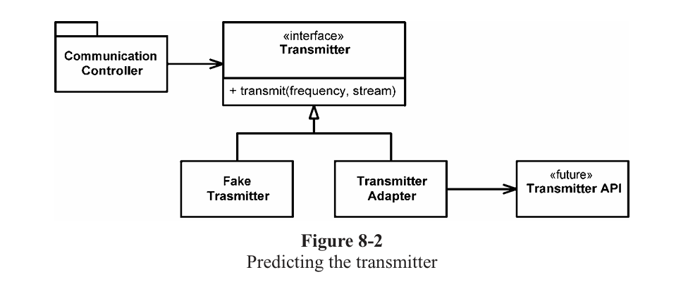

# مرزها


<div dir="rtl">
اینکه ما بر روی تمام نرم افزارهای سیستم تسلط داشته باشیم و همه را خودمان توسعه داده باشیم تقریبا غیر ممکن است. به همین خاطر بسته‌های نرم افزاری را خریداری می‌کنیم(Third-party Packages) یا از نرم افزارهای متن‌باز استفاده می‌کنیم. مواقعی هم هست که از تیم‌های دیگر که در شرکت هستند می‌خواهیم که یک کامپوننت یا زیرسیستم را برای ما توسعه دهند. مسئله‌ای که در اینجا مطرح می‌شود یکپارچه کردن این نرم‌افزارها با سیستم و کدهای خودمان است. در این فصل به شیوه‌ها و تکنیک‌هایی که کمک می‌کنند تا مرزهای کد خود را مشخص کنیم و آنها را تمیز نگه‌ داریم می‌پردازیم.

## استفاده از کدهای third-party

بین توسعه‌دهندگان و استفاده کنندگان یک رابط کاربری(API) معمولا تنش‌های زیادی وجود دارد.
توسعه‌دهندگان کتابخانه‌ها و بسته‌های نرم‌افزاری تلاش می‌کنند تا آنها را طوری توسعه دهند که در طیف گسترده‌ای از نرم‌افزارها و چالش‌ها قابل استفاده باشند و بتوانند استفاده کنندگان و کاربران بسیاری را برای محصولات خود جذب کنند.

در سوی دیگر کاربرانی که قصد استفاده از این نرم افزارها را دارند به کدها و بسته‌هایی نیاز دارند که دقیقا بر روی نیاز آنها تمرکز کرده باشد و به موارد دیگر نپردازد. این تنش باعث مشکلات زیادی در اسکوپ سیستم می‌شود.

به عنوان یک مثال بیایید نگاهی به java.util.Map  داشته باشیم.
همانطور که در در لیست 8.1 می‌توانید ببینید، Map ها تعداد بسیار زیادی رابط دارند که باعث می‌شوند گستره استفاده وسیعی نیز داشته باشند. مطمئنا این انعطاف و قدرت می‌تواند بسیار مفید باشد اما همزمان می‌تواند یک نقص نیز به شمار آید.
بگذارید با یک مثال این مسئله را روشن کنیم:

فرض کنید ما یک برنامه داریم که یک Map را می‌سازد و آن را ارسال می‌کند. هدف ما این است که هیچ کدام از گیرندگان اجازه و توانایی حذف هیچ عضوی از این Map را نداشته باشد. اما  همانطور که در لیست زیر می‌بینید تابع ()clear این قابلیت را در اختیار گیرندگان قرار می‌دهد تا بتوانند عضوی را حذف کنند.

یا در مثالی دیگر، ما می‌خواهیم تنها انواع(Type) خاصی از اشیا بتوانند به Map اضافه شوند، اما هیچ راه مطئمنی برای محدود کردن انواع وجود ندارد و هر کاربری می‌تواند هر نوعی را به یک Map اضافه کند. 

لیست 8.1

* clear() void – Map 
* containsKey(Object key) boolean – Map 
* containsValue(Object value) boolean – Map 
* entrySet() Set – Map 
* equals(Object o) boolean – Map 
* get(Object key) Object – Map 
* getClass() Class<? extends Object> – Object 
* hashCode() int – Map 
* isEmpty() boolean – Map 
* keySet() Set – Map 
* notify() void – Object 
* notifyAll() void – Object 
* put(Object key, Object value) Object – Map 
* putAll(Map t) void – Map 
* remove(Object key) Object – Map 
* size() int – Map 
* toString() String – Object 
* values() Collection – Map 
* wait() void – Object 
* wait(long timeout) void – Object 
* wait(long timeout, int nanos) void – Object 

اگر برنامه‌ی ما به یک Map از سنسورها نیاز داشته باشد، احتمالا شما برای ساختن آن کدی مانند زیر را پیشنهاد می‌دهید:
</div>

```java
Map sensors = new HashMap();
```

<div dir="rtl">
سپس زمانی که نیاز به دسترسی به یکی از سنسورها را داشته باشد از کد زیر استفاده می‌کند:
</div>

```java
Sensor s = (Sensor)sensors.get(sensorId );
```

<div dir="rtl">
احتمالا کد بالا بارها و بارها در برنامه دیده خواهد شد. کسی که این کد را نوشته احتمالا این قصد را داشته که یک عضو از Map را بگیرد و آن را به نوع درست تغییر دهد.

این قطعه کد این کار را انجام می‌دهد، اما تمیز نیست. همچنین این کد مسئولیتی که برعهده دارد(دریافت یک عضو از Map) را به درستی بیان نمی‌کند. خوانایی این قطعه کد را می‌توان با استفاده از جنریک تا حد بسیار خوبی بهبود بخشید، در کد زیر این مورد را می‌بینید: 
</div>

```java
Map<Sensor> sensors = new HashMap<Sensor>();
...
Sensor s = sensors.get(sensorId );
```

<div dir="rtl">
از موضوع مورد بحث خارج نشویم. این تغییرات مشکل کد(اسکوپ) را حل نمی‌کند. Map<Sensor> اختیاراتی بیش از آنچه نیاز هست را ارائه می‌دهد. ارسال یک نمونه از Map<Sensor> در سراسر سیستم  به این معنی است که جاهای بسیاری وجود دارد که در صورت تغییر در یک جا باید در آنها نیز تغییرات اعمال شود.

شاید به این فکر کنید که تغییراتی در این ابعاد بعید است اما نسخه 5 جاوا را به یاد آورید که در آن جنریک به جاوا اضافه شد و تغییرات گسترده‌ای را باعث شد. در طی این به روز رسانی سیستم‌هایی بودند که به دلیل بزرگی نتوانستند از امکانات و مزیت‌های جنریک استفاده کنند.

یک راه تمیزتر برای استفاده از جنریک می‌تواند کد زیر باشد. هیج کاربری که از Sensores استفاده می‌کند ممکن است اصلا به این که به صورت جنریک نوشته شده باشد اهمیتی ندهد.
</div>

```java
public class Sensors {
    private Map sensors = new HashMap();
    public Sensor getById(String id) {
        return (Sensor) sensors.get(id);
    }
    //snip
}
```

<div dir="rtl">
رابط‌ها(Interface) در مرزها(Boundary) پنهان هستند. این موضوع می‌تواند تاثیر کمتری بر دیگر بخش‌ها بگذارد. استفاده از جنریک‌ها دیگر یک مشکل بزرگ و یک مسئله نیست زیرا با مفاهیم تغییر نوع(Type Casting) و همچنین مدیریت نوع(Type Management) کاملا کنترل شده است.

این سبک نوشتار منجر به پیچیدگی کمتر و درک بهتر می‌شود، همچنین سو استفاده از آن را نیز سخت‌تر می‌کند.در کلاس Sensors می‌توان منطق تجاری را طراحی و پیاده سازی کرد. درست است که این گونه کد نوشتن مزیت‌هایی دارد اما ما شما را محدود و مجبور به استفاده همیشگی از چنین کدهایی نمی‌کنیم.توصیه ما این است که مانند این مثال مرزهای برنامه را همیشه مشخص کنید و آنها را رعایت کنید.اگر در برنامه خود از یک رابط که مرزهای زیادی دارد(مانند Map) استفاده می‌کنید آن را در کلاس یا خانواده‌ای از کلاس‌ها که به آن نیاز دارند محصور کنید و از بازگرداندن(return) آن به عنوان خروجی یا پذیرش آن به عنوان یک آرگومان ورودی جدا خود داری کنید.

## کاوش و یادگیری مرزها
کدهای Third-party به ما کمک می‌کنند تا عملکردهای بیشتری را در مدت زمان کمتری در اختیار داشته باشیم. به نظر شما وقتی می‌خواهیم از پکیج‌های خارجی استفاده کنیم باید از کجا شروع کنیم؟ این وظیفه‌ی ما نیست که این کدها را بیازماییم(Testing) اما ممکن است در مواردی نیاز باشد که این کار را انجام دهیم و برای کدهای خارجی هم تست بنویسیم.

فرض کنید که نحوه استفاده از یک کتابخانه برای ما روشن نیست. احتمالا ما مجبور می‌شویم یک یا دو روز یا حتی بیشتر را صرف خواندن مستندات آن کنیم تا نحوه استفاده آن را یاد بگیریم. سپس به نوشتن کدهای خودمان بپردازیم تا ببینیم آیا عملکردی که فکر می‌کردیم را از کتابخانه دریافت می‌کنیم. 

این که در این مواقع زمان زیادی را صرف خطایابی کنیم یک چیز کاملا معمول در بین برنامه نویس‌ها است تا متوجه شوند که آیا ایراد از کد آنها است یا از کتابخانه‌ای که استفاده کرده‌اند. یادگیری کدهای طرف سوم سخت است، یکپارچه سازی آنها سخت‌تر! انجام این دو به صورت همزمان پیچیدگی و سختی را دو چندان می‌کند. آیا می‌توان رویکرد متفاوتی اتخاذ کرد؟  به جای نوشتن و آزمودن کدهای جدید روی کدهای محصول خود، می‌توانیم با نوشتن تست برای کدهای طرف سوم، عملکرد و رفتار آنها را راحت‌تر درک کنیم.
`Jim Newkirk` به این نوع تست‌‌ها `learning test` می‌گوید.
در تست‌های یادگیری ما رابط‌های کاربری(API) کدهای طرف سوم را در شرایطی مشابه شرایطی که می‌خواهیم از آنها استفاده کنیم صدا می‌زنیم تا عملکرد آنها را در تست متوجه شویم.
در واقع ما یک تجربه‌ی کنترل شده داریم تا فهم خود را از APIها و عملکرد آنها را بیازماییم. تست‌ها بر روی آنچه ما از APIها انتظار داریم متمرکز می‌شوند.

## یادگیری log4j
فرض کنید که در یک پروژه ما قصد داریم از بسته‌ی `log4j` شرکت آپاچی به عنوان لاگر استفاده کنیم.
ما آن را دانلود می‌کنیم و مشابه آنچه در داکیومنت‌های آن ذکر شده آن را نصب می‌کنیم. بدون مطالعه‌ی هیچ چیز اضافه‌ای اولین تست کیس خود را می‌نویسیم، انتظار داریم که در کنسول عبارت "hello" نمایش داده شود.
</div>

```java
@Test
public void testLogCreate() {
    Logger logger = Logger.getLogger("MyLogger");
    logger.info("hello");
}
```

<div dir="rtl">
زمانی که ما این کد را اجرا می‌کنیم، لاگر یک خطا تولید می‌کند که به ما می‌گوید به یک چیز دیگر به نام Appender نیاز دارد. بعد از کمی مطالعه متوجه می‌شویم که یک ConsoleAppender نیز وجود دارد.
بنابراین ما آن را ساخته و می‌بینیم که راز لاگ کردن در کنسول فاش می‌شود.
</div>

```java
@Test
public void testLogAddAppender() {
    Logger logger = Logger.getLogger("MyLogger");
    ConsoleAppender appender = new ConsoleAppender();
    logger.addAppender(appender);
    logger.info("hello");
}
```

<div dir="rtl">
در این هنگام ما در میابیم که Appender جریان خروجی ندارد. عجیب است،  منطقا باید چنین چیزی در آن وجود داشته باشد. بعد از کمی جست و جو در گوگل موارد زیر را امتحان می‌کنیم:
</div>

```java
@Test
public void testLogAddAppender() {
    Logger logger = Logger.getLogger("MyLogger");
    logger.removeAllAppenders();
    logger.addAppender(new ConsoleAppender(
    new PatternLayout("%p %t %m%n"),
    ConsoleAppender.SYSTEM_OUT));
    logger.info("hello");
}
```

<div dir="rtl">
کار کرد!
یک پیام لاگ که شامل عبارت "hello" می‌باشد در کنسول نمایش داده می‌شود.
عجیب به نظر می‌رسد که از ConsoleAppender بخواهیم که در کنسول چیزی را چاپ کند.

جالب است که اگر ما آرگومان ConsoleAppender.SystemOut را حذف کنیم هنوز هم عبارت "hello" در خروجی کنسول نشان داده می‌شود.
اما اگر PatternLayout را حذف کنیم یکبار دیگر برنامه از کار می‌افتد و این یک رفتار عجیب است.

اگر کمی دقیق‌تر به مستندات نگاه کنیم متوه می‌شویم که سازنده‌ی پیشفرض ConsoleAppender در حالت `unconfigured` است، که قابل استفاده نمی‌باشد.
این مورد مانند یک باگ یا یک ناسازگاری در log4j است. 

بعد از مطالعه و جست و جوی بیشتر در نهایت ما به لیستی مانند لیست 8.1 می‌رسیم . ما چیزهای زیادی را درمورد log4j یاد گرفتیم و آنها را در قالب مجموعه‌ای تست‌های واحد ساده لیست کردیم:

</div>

Listing 8.1 -- LogTest.java
```java
public class LogTest {
    private Logger logger;
    @Before
    public void initialize() {
        logger = Logger.getLogger("logger");
        logger.removeAllAppenders();
        Logger.getRootLogger().removeAllAppenders();
    }
    @Test
    public void basicLogger() {
        BasicConfigurator.configure();
        logger.info("basicLogger");
    }
    @Test
    public void addAppenderWithStream() {
        logger.addAppender(new ConsoleAppender(
        new PatternLayout("%p %t %m%n"),
        ConsoleAppender.SYSTEM_OUT));
        logger.info("addAppenderWithStream");
    }
    @Test
    public void addAppenderWithoutStream() {
        logger.addAppender(new ConsoleAppender(
        new PatternLayout("%p %t %m%n")));
        logger.info("addAppenderWithoutStream");
    }
}
```

<div dir="rtl">
اکنون می‌دانیم که چگونه یک کنسول لاگر ساده را مقدار دهی کنیم و می‌توانیم با کپسوله کردن آن در کد خودمان، مرزهای استفاده آن را محدود و آن را امن‌تر کنیم.

## تست‌های یادگیری از یادگیری آزاد بهتر هستند

تست‌های یادگیری در نهایت هیچ هزینه‌ای ندارند. به هر حال باید API را یاد می‌گرفتیم و نوشتن آن تست‌ها راهی آسان و مجزا برای به دست آوردن این دانش بود. تست‌های یادگیری آزمایش‌های دقیقی بودند که به افزایش درک ما کمک کردند.
نه تنها تست‌های یادگیری رایگان هستند بلکه یادگیری استفاده از آنها نوعی سرمایه گذاری نیز به حساب می‌آید. زمانی که نسخه‌های جدیدی از این کدها و کتابخانه‌ها منتشر می‌شوند ما با اجرای همان تست‌ها می‌توانیم بفهمیم که آیا در نسخه جدید رفتار متفاوتی وجود دارد یا خیر.

توسعه‌دهندگان اصلی این کدها معمولا برای اینکه نیازهای جدید را پاسخ دهند تحت فشار هستند.

آنها مجبورند تا باگ‌ها را برطرف کنند و قابلیت‌های جدید را به کدهای خود بی‌افزایند، اگر این تغییرات باعث شود که رفتاری ناسازگار با کدهای ما از آنها سر بزند، با اجرای تست‌ها ما فورا متوجه خواهیم شد.

چه به این شیوه‌ی یادگیری معتقد باشید چه نباشید، تست‌ها باید یک مرز خارجی تمیز و مشخص برای عملکردهای مشابه برنامه به وجود بیاورند تا اسکوپ و مرزهای برنامه مشخص باشد.

## استفاده از کدهایی که هنوز وجود ندارند
نوع دیگری از مرزها وجود دارند، نوعی که معلومات را از مجهولات تمایز می‌دهند.
جاهایی در مسیر کد وجود دارند که از دانش ما فراتر هستند. گاهی هیچ دیدی از آنچه که ممکن است در آینده رخ دهد نداریم. گاهی انتخاب می‌کنیم یا مجبور می‌شویم که فراتر از مرزهای کد را نبینیم.

چند سال پیش من عضوی از یک تیم توسعه نرم‌افزار برای سیستم ارتباطات رادیویی بودم. یک زیرسیستم به نام «فرستنده» وجود داشت که ما اطلاعات کمی درباره آن داشتیم، و افراد مسئول این زیرسیستم به نقطه تعریف رابط خود نرسیده بودند. ما نمی‌خواستیم معطل شویم، بنابراین کار خود را دور از قسمت ناشناخته کد شروع کردیم.

ما دید بسیار خوبی از این که مرزهای زیرسیستم ما کجا شروع می‌شوند و در کجا خاتمه می‌یابند داشتیم. اگر چه نداشتن اطلاعات از آن سوی سیستم ما را در یک جهل قرار داده بود اما این کار ما باعث شد تا از آنچه که از رابط با آن زیر سیستم انتظار داشتیم آگاه شویم و این مسئله برای ما شفاف شود.

ما می‌خواستیم چنین چیزی به فرستنده بگوییم:
فرستنده را روی فرکانس ارائه شده کلید زده و آن، یک نمایش آنالوگ از داده‌های حاصل از این جریان منتشر می‌کند. ما نمی‌دانستیم که چگونه این کار انجام می‌شود زیرا API هنوز طراحی نشده بود. بنابراین تصمیم گرفتیم که بعداً جزئیات را بررسی کنیم. برای جلوگیری از معطل  شدن، رابط کاربری خود را تعریف کردیم. اسمی که برای آن انتخاب کرده بودیم یک اسم جذاب  مانند فرستنده بود. ما یک تابع به نام "transmit" تعریف کردیم که یک فرکانس و یک جریان داده را  به عنوان ورودی می‌گرفت. این رابطی بود که انتظار داشتیم داشته باشیم.


یک نکته مثبت درمورد نوشتن یک رابط که مورد انتظار ما بود این بود که تحت کنترل ما بود. این به ما کمک می‌کرد که خوانایی کد مشتری را حفظ کنیم و بر روی وظیفه‌ای که باید انجام می‌شد متمرکز شویم.

در شکل 8-2، می بینید که ما کلاس‌های CommunicationsController را از API فرستنده (که خارج از کنترل ما بود و تعریف نشده بود) ایزوله کردیم. با استفاده از رابط کاربری مشخص برنامه خود، کد CommunicationsController خود را تمیز و گویا نگه داشتیم. هنگامی که API فرستنده تعریف شد، TransmitterAdapter را نوشتیم تا شکاف را پر کنیم. ADAPTER2 تعامل با API را کپسوله می کند و یک نقطه واحد برای تغییر، در زمانی که API تکامل می یابد، فراهم می کند.

</div>

 

<div dir="rtl">
این طراحی همچنین به ما یک اطمینان درمورد تست‌ها به ما می‌دهد. با استفاده از یک  FakeTransmitter ما می‌توانیم کلاس‌های CommunicationsController را تست کنیم.

##  مرزهای مشخص
اتفاقات جالبی در مرزهای برنامه‌ها می‌افتد. یکی از این اتفاقات تغییرات است. یک طراحی نرم افزاری خوب، طراحی‌ای است که بتواند با حداقل هزینه و زمان تغییرات را مدیریت کند و انعطاف مناسبی در برابر آنها داشته باشد.
زمانی که از یک کد که خارج از کنترل ما است استفاده می‌کنیم باید به شدت مواظب باشیم تا طراحی مناسب خود را از دست ندهیم و هزینه‌های جاری و آتی اضافه‌ای را به سیستم تحمیل نکنیم.

کد در مرزها نیاز به جداسازی واضح و تست‌هایی دارد که انتظارات را مشخص می‌کند. ما باید از اطلاع بیش از حد کد خود در مورد جزئیات کدهای طرف سوم خودداری کنیم. بهتر است به چیزی که کنترل می‌کنیم متکی باشیم تا چیزی که کنترل آن را نداریم، تا مبادا در نهایت شما را کنترل کند.

ما مرزهای شخص ثالث را با داشتن مکان های بسیار کمی در کد که به آنها اشاره دارد، مدیریت می کنیم. ممکن است آنها را همانطور که با Map انجام دادیم بپیچانیم، یا ممکن است از یک آداپتور برای تبدیل از رابط کامل خود به رابط ارائه شده استفاده کنیم. در هر صورت کد ما بهتر با ما صحبت می‌کند، در استفاده‌های داخلی سازگارتر است و هنگام تغییر کد طرف سوم، نقاط کمتری برای نگهداری دارد.
</div>


* [فصل بعد](../9_Unit_Tests/9_Unit_Tests.md)
* [فصل قبل](../7_Error-Handling/Error-Handling.md)