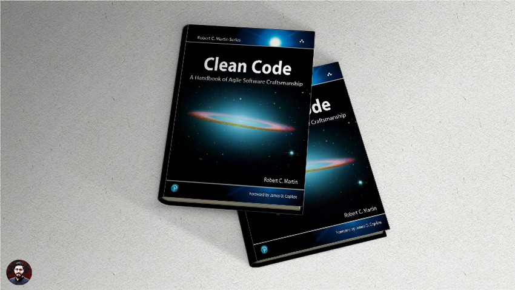

<h1 align="center" dir="rtl"> ترجمه آزاد کتاب کد تمیز</h1>

  

این پروژه یک کار گروهی برای ترجمه آزاد یکی از بهترین کتاب های برنامه نویسیه.

## راهنمای مشارکت
حتی ترجمه ی یک صفحه خیلی میتونه بهمون کمک کنه .

فصل هایی از کتاب ترجمه نشده و بعضی از قسمت های کتاب خیلی ترجمه ی درست و حسابی ای نداره . اون بخش هارو اکه وقت کردید ترجمه کردید یه request باز کنید منم سر فرصت یه چک میکنم و به باقی بخش ها اضافه میکنم .

اگر تصمیم گرفتید یک فصل رو کامل ترجمه کنید لطفا قبلش یه ایمیل به <a href="mailto: tty.mohseni@gmail.com">این آدرس</a>  بزنین تا توسط شخص دیگه یا خودم ترجمه نشه و دوباره کاری پیش نیاد :)
 
## بخش های ترجمه شده

* [مقدمه](Book/0_introduction/introduction.md)

* [فصل 1 : کد تمیز](Book/1_Clean_Code/clean-code.md)

* [فصل 2 : اسامی با معنی](Book/2_meaningful-names/meaningful-names.md)

* [فصل 3 : توابع](Book/3_Functions/3_Functions.md)

* [فصل 4 : کامنت ها](Book/4_Comments/4_Comments.md)

* [فصل 5 : فرمت دهی](Book/5_Formatting/5_Formatting.md)

* [فصل 6 : اشیا و ساختار های داده](Book/6_Objects-And-Data-Structures/Objects-And-Data-Structures.md)

* [فصل 7 : مدیریت خطا](Book/7_Error-Handling/Error-Handling.md)

* [فصل 8 : مرز ها](Book/8_Boundaries/8_Boundaries.md)

* [فصل 9 : unit تست](Book/9_Unit_Tests/9_Unit_Tests.md)

* [فصل 10 : کلاس ها](Book/10_Classes/Classes.md)